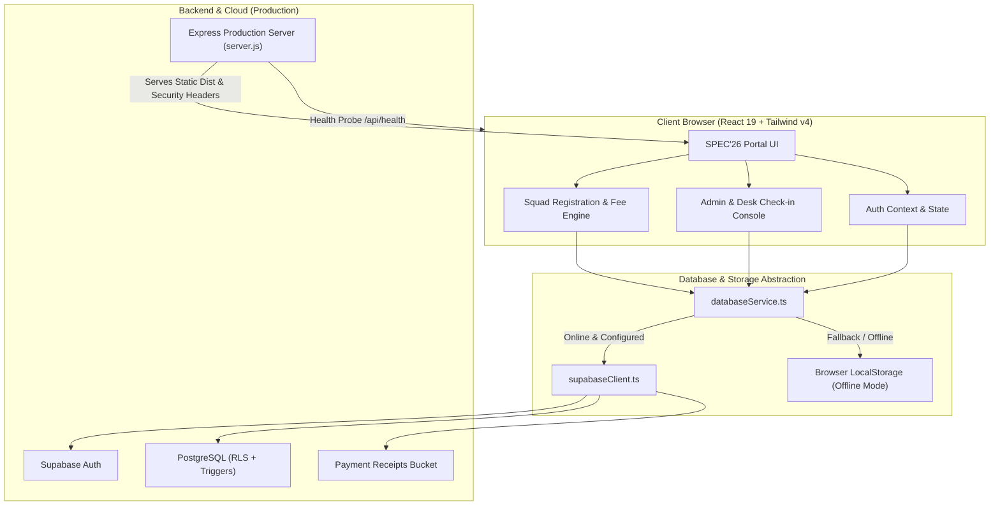

# SPEC'26 — Students' Project Exhibition & Competition
### Department of Electronic Engineering, NED University of Engineering & Technology, Karachi

[](https://react.dev/)
[](https://www.typescriptlang.org/)
[](https://vitejs.dev/)
[](https://tailwindcss.com/)
[](https://expressjs.com/)
[](https://supabase.com/)
[](https://www.docker.com/)

---

## ⚡ Executive Summary

**SPEC'26** is the official digital exhibition and competition management platform engineered for the annual flagship event hosted by the **Department of Electronic Engineering at NED University of Engineering & Technology, Karachi**.

The platform provides a secure, high-performance web portal for engineering undergraduates, industry jury members, faculty evaluators, and event organizers. It supports 11 technical engineering tracks spanning hardware circuit design, robotics, algorithmic programming, and capstone project exhibitions.

---

## ✨ Key Features & Capabilities

- **11 Engineering Tracks**: Complete registration matrices, fee structures, team limits, and competition guidelines covering Electronics, Robotics, Programming, Project Exhibition, and Esports.
- **Dynamic Squad Registration & Fee Engine**: Automated member count validation, dynamic fee calculations (Solo vs. Team pricing), real-time input sanitization, and downloadable registration tokens.
- **Proof of Payment Engine**: Digital voucher verification supporting NBP/JazzCash/EasyPaisa receipts with file-size limits (5 MB max), MIME-type validation, and live receipt modal previews.
- **Desk Pass & Registration Token Generation**: Downloadable verification passes (`SPEC26-PASS-*.txt`) with unique alphanumeric registration tokens and instant clipboard copy.
- **Command & Admin Dashboard**:
  - Live metric telemetry (total submissions, verified revenue, verification queue).
  - One-click approval / rejection workflow with instant audit trail.
  - One-click **RFC 4180 compliant CSV export** for desk registration and on-site check-in.
  - Printable official desk pass modal with QR-style token layout.
- **Dual-Mode Persistence Architecture**:
  - **Cloud Mode**: Full Supabase integration (PostgreSQL, Row Level Security, automatic user profile trigger, storage buckets).
  - **Resilient Offline/Demo Mode**: Gracefully activates when Supabase credentials are not provided or network is offline, utilizing transactional LocalStorage with full CRUD parity.
- **Hardened Production Server**: Dedicated Express.js static file server with RFC-standard security headers (`X-Content-Type-Options`, `X-Frame-Options`, `Referrer-Policy`), 1-year immutable caching for hashed assets, `/api/health` monitoring probe, and graceful shutdown signal traps.
- **Optimized Bundle Performance**: Route-level code splitting (`React.lazy` + `Suspense`) and custom Rollup chunking (`vendor-react`, `vendor-supabase`, `vendor-lucide`, `vendor-motion`), shrinking the initial load bundle to **~35 kB**.

---

## 🏛️ System Architecture



---

## 🚀 Quick Start Guide

### Prerequisites
- **Node.js** (v18.0.0 or later) OR **Bun** (v1.1.0 or later)
- Git

### 1. Clone & Install Dependencies

```bash
# Clone the repository
git clone https://github.com/your-username/spec26-ned-engineering-exhibition.git
cd spec26-ned-engineering-exhibition

# Install dependencies using Bun (recommended)
bun install

# Or install dependencies using npm
npm install
```

### 2. Environment Configuration

Create a local environment file by copying `.env.example`:

```bash
cp .env.example .env.local
```

Configure your environment variables in `.env.local`:

```env
# Application Host
PORT=3000
HOST=0.0.0.0

# Supabase Credentials (Optional: omit to run in Offline/Local Mode)
VITE_SUPABASE_URL="https://your-project-ref.supabase.co"
VITE_SUPABASE_ANON_KEY="your-anon-public-key"
```

> [!NOTE]
> The application will run **100% out of the box** even without Supabase credentials. It will automatically operate in offline demonstration mode, storing registrations and authentication in browser storage.

### 3. Run Development Server

```bash
# Using Bun
bun run dev

# Using npm
npm run dev
```

Open [http://localhost:3000](http://localhost:3000) in your browser.

---

## 🗄️ Supabase Cloud Database Setup

To enable cloud persistence across users:

1. Create a project at [supabase.com](https://supabase.com).
2. Go to the **SQL Editor** in your Supabase dashboard.
3. Open [`supabase/schema.sql`](file:///c:/Users/ahsan/Downloads/spec'26---ned-university-engineering-exhibition/supabase/schema.sql) from this repository, paste the contents, and run the script. This sets up:
   - `profiles` table with automatic user creation trigger on `auth.users`
   - `competitions` table with all 11 SPEC'26 tracks pre-seeded
   - `registrations` and `team_members` tables with foreign keys and cascade deletions
   - Row-Level Security (RLS) policies for user data isolation and administrator controls
   - `payment-receipts` public storage bucket with upload and viewing rules
4. Copy your **Project URL** and **Anon API Key** from `Project Settings > API` into `.env.local`:
   ```env
   VITE_SUPABASE_URL="https://xxxxxxxxxxxx.supabase.co"
   VITE_SUPABASE_ANON_KEY="eyJhbGciOi..."
   ```

---

## 🔑 Demo & Evaluation Accounts

The platform includes pre-configured credentials for quick evaluation:

| Role | Email | Password | Access Privileges |
| :--- | :--- | :--- | :--- |
| **Administrator** | `admin@neduet.edu.pk` | `admin123` | Full Admin Console, verification controls, CSV export, desk pass generation, competition management |
| **Participant** | `m.ali@cloud.neduet.edu.pk` | *(demo mode)* | Track registration, team management, receipt upload, downloadable entry pass |

*(You can also register any new account at `/signup` with instantaneous login.)*

---

## 📦 Production Build & Testing

### 1. Compile Type Check & Production Bundle

```bash
# Type-check TypeScript code
bun run lint

# Build optimized production bundle
bun run build
```

The compiled assets will be output to the `dist/` directory:
- Main bundle entry: **~35 kB**
- Vendor React chunk: **~190 kB**
- Dynamic routes chunked on demand

### 2. Run Production Server Locally

```bash
bun run start
# Or with Node
npm run start
```

The Express production server will launch at [http://localhost:3000](http://localhost:3000).

Verify the health check endpoint:
```bash
curl http://localhost:3000/api/health
# {"status":"ok","uptime":...,"timestamp":"...","environment":"production"}
```

---

## 🐳 Docker Deployment

The repository includes an optimized multi-stage Alpine Dockerfile.

### 1. Build the Docker Image

```bash
docker build -t spec26-portal:latest .
```

### 2. Run the Container

```bash
docker run -d \
  --name spec26 \
  -p 3000:3000 \
  -e PORT=3000 \
  -e VITE_SUPABASE_URL="https://your-project.supabase.co" \
  -e VITE_SUPABASE_ANON_KEY="your-anon-key" \
  spec26-portal:latest
```

The container runs as a non-privileged `nodejs` user and includes an automated `HEALTHCHECK` pinging `/api/health`.

---

## ☁️ Cloud Platform Deployments

### Vercel Deployment
The project includes a pre-configured [`vercel.json`](file:///c:/Users/ahsan/Downloads/spec'26---ned-university-engineering-exhibition/vercel.json) supporting Single Page Application (SPA) rewrites.
```bash
npx vercel
```
Set `VITE_SUPABASE_URL` and `VITE_SUPABASE_ANON_KEY` in your Vercel Project Environment Variables.

### Netlify Deployment
The project includes [`public/_redirects`](file:///c:/Users/ahsan/Downloads/spec'26---ned-university-engineering-exhibition/public/_redirects) for client-side routing.
Connect your repository to Netlify:
- **Build command**: `npm run build`
- **Publish directory**: `dist`

### Google Cloud Run / AWS ECS
Deploy the pre-built Docker image directly to Google Cloud Run or AWS ECS with container port `3000`.

---

## 📁 Repository Structure

```
├── .dockerignore                 # Excluded paths from Docker builds
├── .env.example                  # Environment variable reference template
├── .gitignore                    # Git tracking ignore rules
├── Dockerfile                    # Multi-stage production container definition
├── index.html                    # HTML entry with Open Graph & brand metadata
├── package.json                  # Scripts, production dependencies & tooling
├── server.js                     # Hardened Express production static file server
├── tsconfig.json                 # TypeScript compiler specifications
├── vercel.json                   # Vercel SPA routing rules
├── vite.config.ts                # Vite 8 config with smart manual code splitting
│
├── public/                       # Static public assets
│   ├── _redirects                # Netlify SPA fallback rule
│   ├── favicon.svg               # SPEC'26 high-resolution brand favicon
│   └── robots.txt                # Search crawler instructions
│
├── src/                          # Application source code
│   ├── App.tsx                   # Main route switch with Suspense & lazy loading
│   ├── main.tsx                  # Client entry point
│   ├── index.css                 # Tailwind CSS v4 design system
│   │
│   ├── components/               # View components
│   │   ├── AdminDashboard.tsx    # Management console, CSV export, desk passes
│   │   ├── CompetitionsPage.tsx  # Track directory with live search & filters
│   │   ├── Countdown.tsx         # Event day countdown ticker
│   │   ├── Footer.tsx            # Department & university footer
│   │   ├── Hero.tsx              # Exhibition showcase banner
│   │   ├── LoginPage.tsx         # User authentication view with password toggle
│   │   ├── Navbar.tsx            # Sticky responsive navigation bar
│   │   ├── RegistrationPage.tsx  # Dynamic registration form & receipt engine
│   │   ├── SchedulePage.tsx      # Multi-day event itinerary
│   │   └── SignupPage.tsx        # Registration portal with role assignments
│   │
│   ├── lib/
│   │   ├── supabase.ts           # Re-exported Supabase client for backward compatibility
│   │   └── supabaseClient.ts     # Unified Supabase client with offline safety check
│   │
│   └── services/
│       └── databaseService.ts    # Resilient sync service (Supabase <-> LocalStorage)
│
└── supabase/
    └── schema.sql                # Production PostgreSQL schema, RLS policies & seed
```

---

## 🛡️ Security & Reliability Architecture

- **Row Level Security**: All queries through Supabase enforce user-isolation policies at the PostgreSQL kernel level.
- **Input Sanitization & Constraints**: All registrations validate member limits per track (e.g. Solo tracks reject squad payloads; 4-person tracks reject >4 members).
- **Voucher Receipt Verification**: File uploads strictly validate against arbitrary binaries (`image/*` and `application/pdf` only) and cap at 5 MB.
- **HTTP Security Headers**: Express server automatically attaches `X-Content-Type-Options: nosniff`, `X-Frame-Options: DENY`, `X-XSS-Protection`, and `Referrer-Policy: strict-origin-when-cross-origin`.

---

## 📜 Academic Affiliation

**SPEC'26 (Students' Project Exhibition & Competition)**  
Department of Electronic Engineering  
NED University of Engineering & Technology  
University Road, Karachi - 75270, Pakistan  
Official Portal: [https://www.neduet.edu.pk](https://www.neduet.edu.pk)

---

## 📄 License
This project is proprietary to the Department of Electronic Engineering, NED University of Engineering & Technology. All rights reserved.
